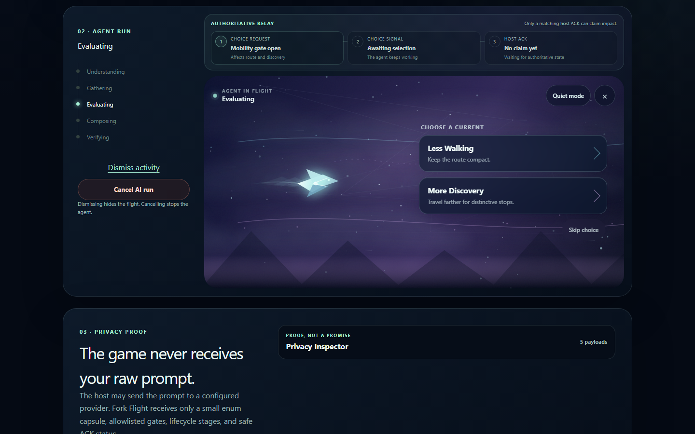
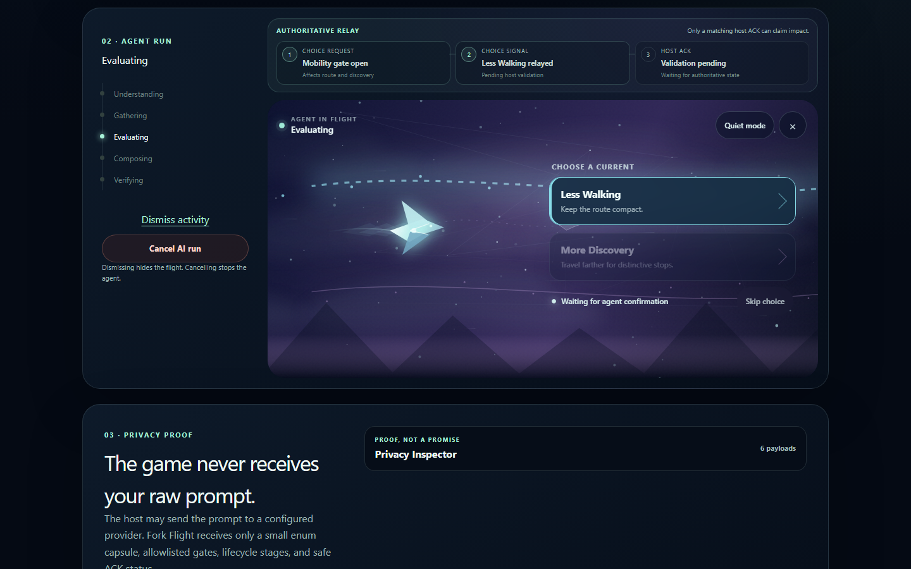
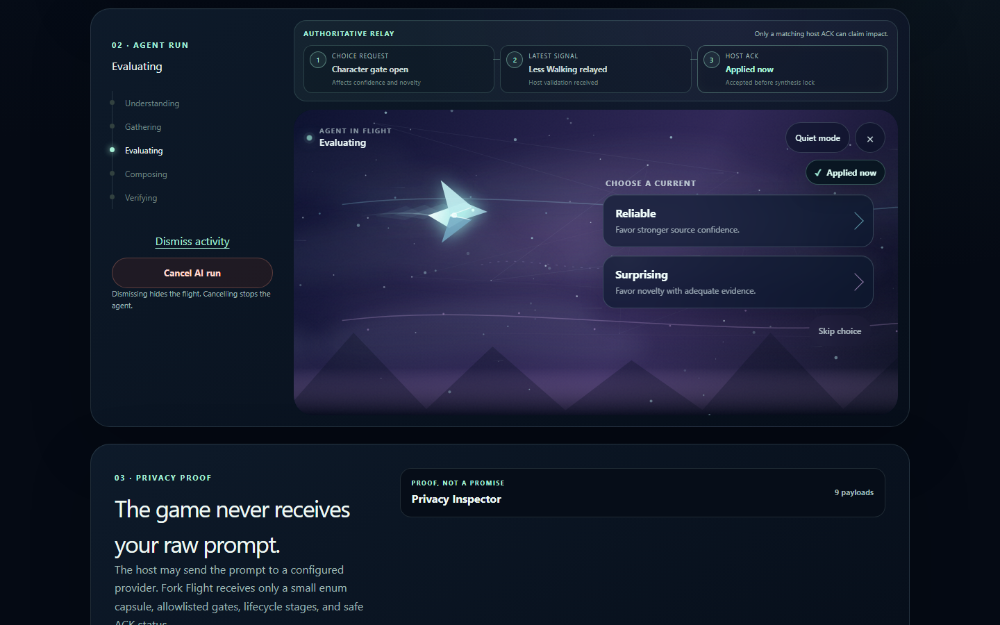
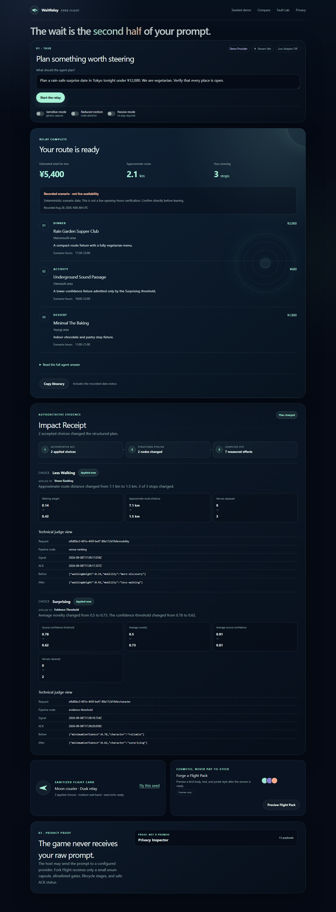
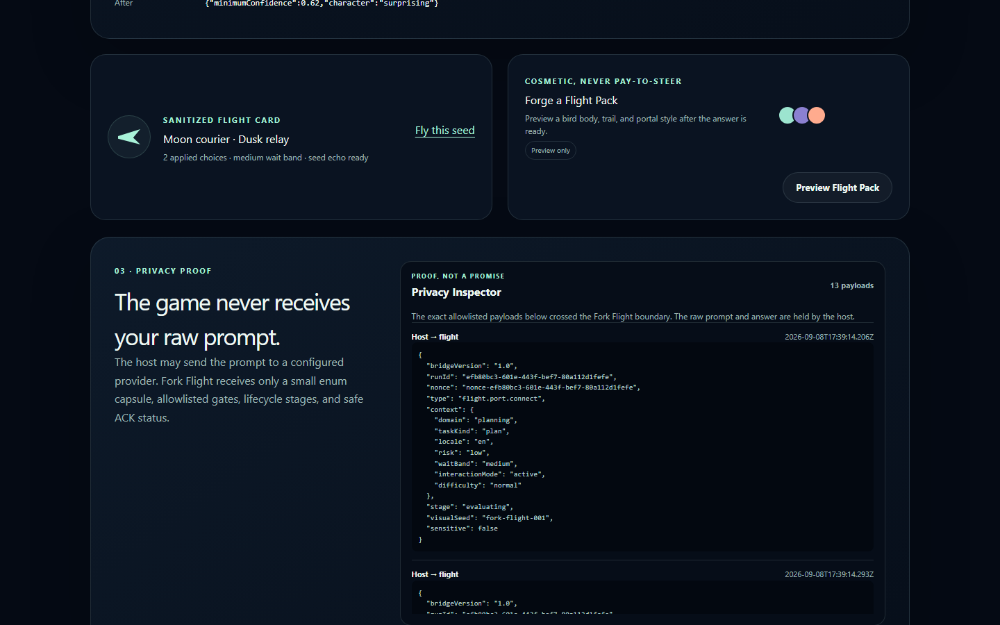
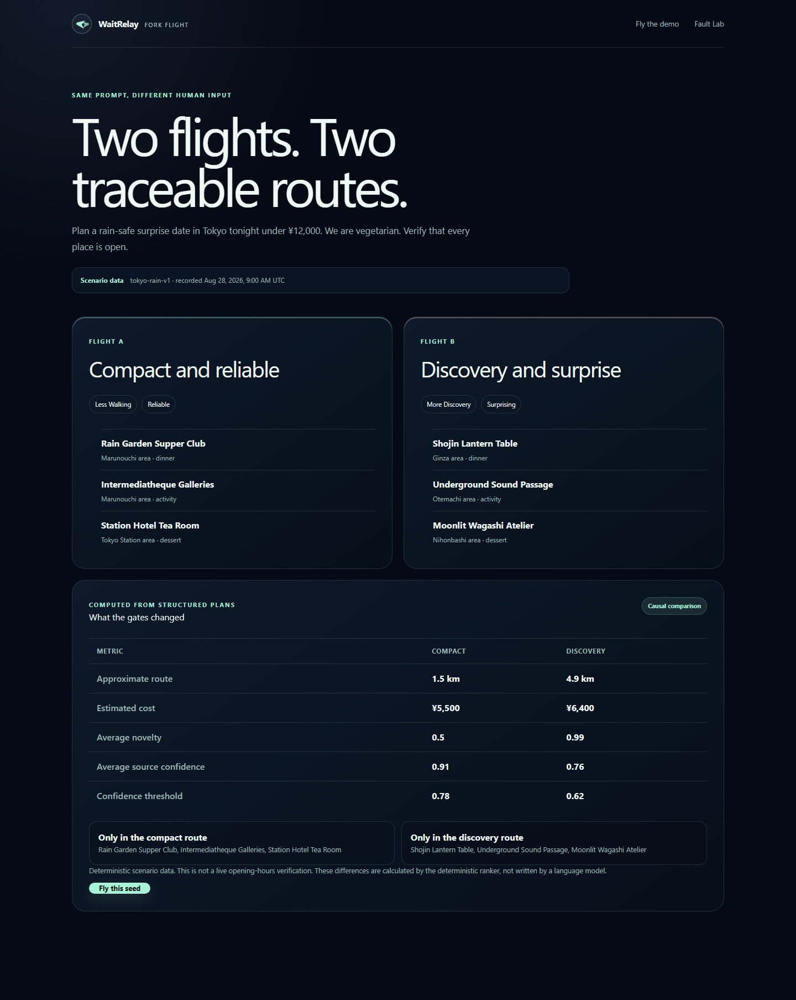
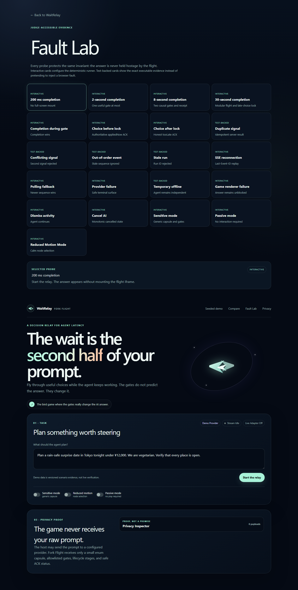

# WaitRelay: Fork Flight

> The wait is the second half of your prompt.

WaitRelay turns unresolved agent decisions into short flight gates. A luminous courier bird carries a choice back to the working agent, and the accepted choice changes the result before the bird lands.

**Judge line:** The bird game where the gates really change the AI answer.

This repository contains a portable full-stack prototype for the Commons/VibeFi "Make Waiting for AI Fun" hackathon. The flagship demonstration plans a rain-safe vegetarian date in Tokyo under ¥12,000. During the run, the player can steer priorities such as Less Walking versus More Discovery and Reliable versus Surprising. The server validates each selection, acknowledges whether it was accepted before the synthesis lock, recalculates the structured plan, and builds an Impact Receipt from the before and after data.

## Judge in 60 seconds

Open the [public seeded demo](https://waitrelay.tangvu.dev/demo?scenario=standard&seed=fork-flight-001). It uses visibly labeled, recorded scenario evidence and requires no credentials.

1. Start the prefilled task. Agent work begins immediately.
2. Choose **Less Walking**. Notice Pending before the authoritative **Applied now** ACK.
3. Choose **Surprising** if the second gate appears. The agent continues independently.
4. Let completion replace the flight, then expand Impact Receipt and Privacy Inspector.
5. Open the [computed comparison](https://waitrelay.tangvu.dev/compare) to see the same scenario produce traceably different plans.

## Why it is different

Most waiting screens decorate latency. WaitRelay uses latency as a second input channel.

- Agent work starts immediately and never waits for the game.
- Gates come from allowlisted, structured agent decisions.
- "Applied now" appears only after an authoritative server ACK.
- Completion always wins. The result appears as soon as it is ready.
- Impact Receipt metrics are computed from system state, not invented by a model.
- The sandboxed flight experience never receives the raw prompt.

## Run the deterministic demo

Requirements: Node.js 20 or newer and pnpm.

Public judge build: `https://waitrelay.tangvu.dev/demo?scenario=standard&seed=fork-flight-001`

```bash
pnpm install
pnpm dev
```

Open:

- `http://localhost:4317/demo?scenario=standard&seed=fork-flight-001`
- `http://localhost:4317/compare`
- `http://localhost:4317/fault-lab`

The Demo Provider uses local, versioned fixtures and seeded timing. Fixture opening information is scenario data, not a claim of live availability. No API credentials are required.

## Real prototype captures

These captures were refreshed from the public production build on September 9
using the deterministic fixture path.



| Signal is pending | Matching host ACK is applied |
| --- | --- |
|  |  |



The September 9 result view adds structured stop cards, a visible recorded-data
notice, and explicit copying with a manual fallback. See the updated
[desktop result](demo/structured-result-desktop.png) and
[mobile result](demo/structured-result-mobile.png). Both captures were verified
against the public production build.







For the flagship flow, submit:

```text
Plan a rain-safe surprise date in Tokyo tonight under ¥12,000. We are vegetarian. Verify that every place is open.
```

Choose **Less Walking**, wait for its ACK, then choose **Surprising**. When the result appears, expand the Impact Receipt and Privacy Inspector.

## Architecture at a glance

```text
Prompt -> host orchestrator -> provider adapter -> structured candidates
                |                        |
                v                        v
        allowlisted gate          continued gathering
                |
                v
 sandboxed Fork Flight -> choice.signal -> atomic host ACK
                                        |
                                        v
                              preference snapshot
                                        |
                                        v
                          reranking -> result + receipt
```

The host owns raw prompts, provider credentials, evidence, rankings, and final answers. Fork Flight receives only a sanitized Context Capsule, public lifecycle stages, allowlisted choice labels and identifiers, ACK status, and a visual seed. Server-Sent Events are the primary transport, with snapshot polling as a fail-open fallback. The in-memory store is suitable for a single-instance hackathon deployment.

See [Architecture](docs/ARCHITECTURE.md), [Privacy](docs/PRIVACY.md), and [Threat Model](docs/THREAT_MODEL.md) for the trust boundaries and failure behavior.

## Provider modes

| Mode | Behavior | Label |
| --- | --- | --- |
| Demo Provider | Deterministic local fixtures and seeded timing | Demo Provider |
| Live Provider | Configured OpenAI-compatible analysis and presentation over the versioned Tokyo scenario | Live Provider |
| Fallback replay | Fixture run after an allowed live-provider failure | Fallback Replay |

Fallback is permitted only when `ALLOW_FIXTURE_FALLBACK=1`. It is never presented as live verification.

Copy `.env.example` to `.env.local` to configure optional server-side integrations. Never prefix provider secrets with `NEXT_PUBLIC_`.

## Commands

```bash
pnpm dev
pnpm build
pnpm start
pnpm lint
pnpm typecheck
pnpm test
pnpm test:unit
pnpm test:integration
pnpm test:race
pnpm test:privacy
pnpm test:e2e
pnpm test:a11y
pnpm test:ops
pnpm demo:preflight
pnpm demo:capture
pnpm host:preflight
```

For this Windows host, `pnpm deploy:local` updates the existing production
process with a retained previous build and automatic rollback on build/startup
or hosting-preflight failure. Run the isolated verification first; see
[Local Hosting](ops/LOCAL_HOSTING.md) for the short-outage behavior and recovery
tests. It is a deployment command, not a development-server command.

`demo:preflight` runs the deterministic judge path three times. `demo:capture` refreshes the checked-in proof images from the public build, or from `WAITRELAY_CAPTURE_BASE_URL` when set. Install the Playwright browser locally if requested by the toolchain:

```bash
pnpm exec playwright install chromium
```

## Privacy guarantees

- Fork Flight never receives the raw prompt, provider messages, tool results, final answer, or provider credentials.
- The Privacy Inspector renders the exact sanitized messages sent across the game boundary.
- Browser storage and Flight Cards contain only cosmetic, enum-oriented data.
- Preference memory is off by default.
- Sensitive Mode uses generic visuals and gates and avoids telemetry and sharing.
- A browser raw-prompt canary covers the iframe DOM, actual bridge inspector, flight requests, URL, console, browser storage, and rendered Flight Card. Separate sanitizer tests cover public error projection.

This does **not** mean the prompt never leaves the device. The host and a configured Live Provider may process it. Read [Privacy](docs/PRIVACY.md) for the precise claim.

## Accessibility and control

The experience supports touch, mouse, arrow keys, WASD, and visible button alternatives. Passive Mode is always available. Reduced Motion Mode replaces continuous flight with calm constellation choices. Sound and haptics are off by default. Dismiss activity hides Fork Flight without cancelling the agent; Cancel AI run is a separate action.

## Honest limitations

- The default `MemoryRunStore` is process-local and is not suitable for multi-instance production deployment.
- The optional live adapter does not yet convert provider venue records into the structured ranker. It presents the same versioned Tokyo scenario plan and must not be treated as live venue verification.
- No unpublished Commons SDK, agent-state API, payment API, or authentication protocol is assumed.
- Commons payment mode remains unavailable until an official public contract can be verified. The safe default is a non-transactional Flight Pack preview.
- This prototype is a focused Tokyo planning vertical, not a universal waiting-layer SDK.

## Hackathon evidence

The [Judging Matrix](docs/JUDGING_MATRIX.md) maps concrete product and test evidence to Waiting Experience, Originality, Fit, Repeatability, and Execution. The [Demo Script](docs/DEMO_SCRIPT.md) contains the 90-second recording path, seeded fallback, and preflight checklist. The [Submission](docs/SUBMISSION.md) file contains ready-to-use copy with placeholders only for repository and video URLs.

## Safety

The public judge build is served from one local production process through a named Cloudflare Tunnel. No real payment, video publication, or hackathon submission has been performed. Payment failure cannot affect an agent run, and the judged product is complete with payments disabled.
